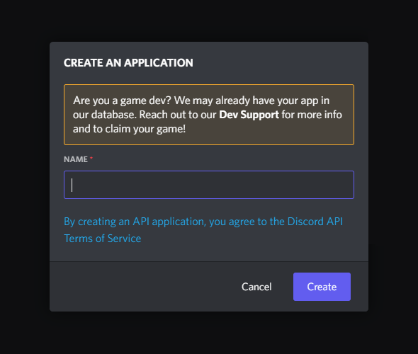

# Getting set up

Before you're able to start coding there are a handful of steps you first need
to go through. This tutorial starts by walking through how to setup a Discord
bot account and use a slash command, running on Replit.

## Creating a Discord bot

Start by navigating to the [Discord Developer Portal]. Assuming you have not
created an application before, it should look like this:


Next, click the "New Application" button in the top right and enter the name
you wish to call your application:



When you have decided on a name, click "Create" and you should see an overview
of your application. Consider filling in a description, giving your application
a profile picture, and specifying some tags:


From this page, **copy the Application ID and Public Key for later**. You will
need these later when coding your bot.

---

Currently your application doesn't have any bot account associated with it. To
change that go to the Bot tab and click "Add Bot":


Click "Yes, do it!" to confirm, you should then see the following page:


Click "Regenerate Token" and copy the token there. Compared to the Application
ID and Public Key, the bot token is sensitive information. Keep this secret.

!!! danger
    Never share your bot token with anybody else. They will be able to do
    anything with the bot - such as delete everything the bot has access to.

    If your token is accidentally exposed, revisit this page and regenerate it
    similarly to how you just did.

## Inviting the created Bot

The very last step before being able to start coding is inviting the bot you
just created. Visit the OAuth2 tab's URL Generator and select `bot` as well as
`applications.commands`:


Now, copy this link and open it in your browser. You should get a prompt
similar to the ones you get inviting any other bot:


Finally select the server you want to add the bot to and click "Authorize":


## Setting up in an IDE

After having created a Discord bot account it is time to setup your IDE. Start
by visiting [Replit] and creating a new Python Repl. Paste in the following
code to get started:

```python
import os

import uvicorn
from wumpy.interactions import (
    InteractionApp, CommandInteraction, command_payload
)


app = InteractionApp(
    os.environ['APPLICATION_ID'], os.environ['PUBLIC_KEY']
    token=os.environ['TOKEN']
)


# Feel free to remove this after using it once to verify that it works!
@app.command()
async def hello(interaction: CommandInteraction) -> None:
    """Your first command; hello world."""
    await interaction.respond('...world')


# When you follow the tutorial, there will be examples you can copy and run
# in your bot. It is important that you place these here - after 'app'
# has been defined, but before uvicorn.run:
...


if __name__ == '__main__':
    uvicorn.run(app, host='0.0.0.0', lifespan='on')
```

Now, install the dependencies by running the following **in the Shell** (not
the Console):

```bash
pip install git+https://github.com/wumpyproject/wumpy.git
```

Before running the code, create secrets for the Application ID, Public Key,
and Token you saved from the Developer portal. They should be named
`APPLICATION_ID`, `PUBLIC_KEY`, and `TOKEN` respectively.

## Setting an Interaction URL

You can now press Run which should open a browser above your console to the
right. Copy the URL and go back to the [Discord Developer Portal] for your
application. Paste it into the Interactions Endpoint URL to this URL and press
"Save Changes".


## Using application commands

With everything setup, try opening a DM with the bot and using the `/hello`
command. You should get a response, like this:


You have now correctly setup a Discord bot account and IDE capable of hosting
it! Continue to the next page of the tutorial.

  [Discord Developer Portal]: https://discord.com/developers/applications/
  [Replit]: https://replit.com/
  [Ngrok]: https://ngrok.com/
